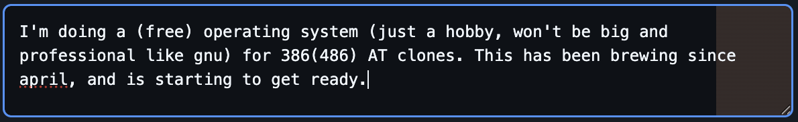

# github-commit-message-width-userscript

Changes the GitHub.com commit message editor:
- Switches to a fixed-width font.
- Changes the background color to indicate where the 72 column limit is.

## How to install

1. Install a userscript manager in your browser, e.g. [Violentmonkey](https://violentmonkey.github.io/)
2. Open your userscript manager and add a new script via URL: <https://raw.githubusercontent.com/cakoose/github-commit-message-width-userscript/main/script.user.js>

## Why?

Git's convention for commit messages is to wrap at 72 columns.

With GitHub's commit message editor, it's hard to know when you've hit 72 columns:

